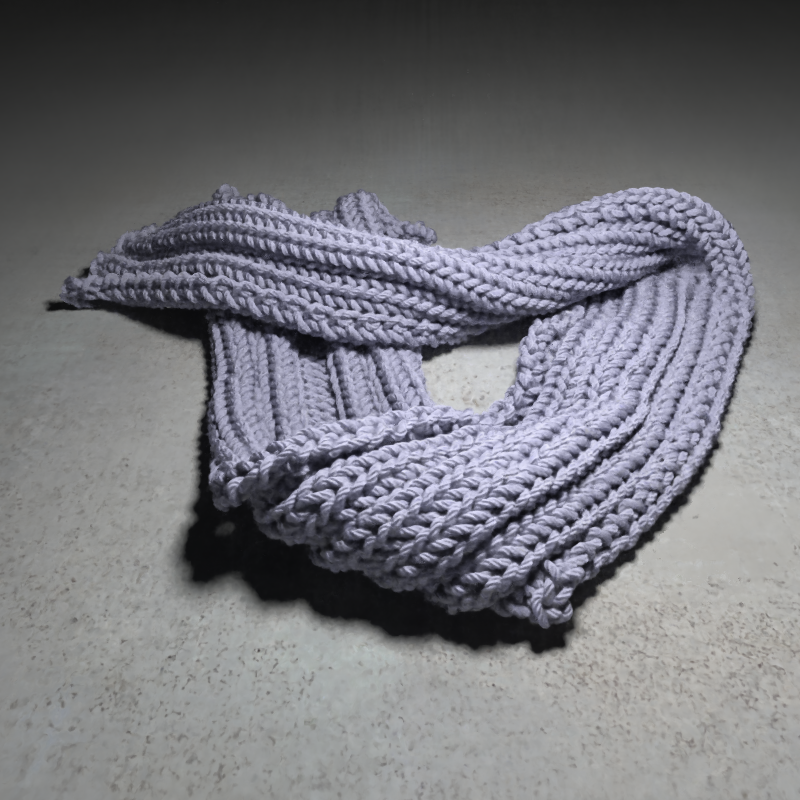

# Jittor 可微渲染新视角生成赛题 NeRF




## 简介

本项目包含了第二届计图挑战赛计图 - 可微渲染新视角生成赛题的代码实现。本项目的特点是：对NeRF的输入进行了简单修改，增加了Depth维度，提升了模型对已有视角的学习能力，取得了比赛A榜第一的结果。

## 安装 

本项目可在 1 张 1080 Ti 上运行，训练时间约为每200k iteration耗时12小时。

#### 运行环境
- ubuntu 18.04 LTS
- python >= 3.7
- jittor >= 1.3.0

#### 安装依赖
执行以下命令安装 python 依赖
```
pip install -r jrender/requirements.txt
```

#### 预训练模型
预训练模型模型下载地址为 链接: https://pan.baidu.com/s/1Sv_5wfdedpKInV3Z_5EYDA?pwd=j4dq 提取码: j4dq，下载后按照云盘中对应目录放在 `jrender/logs/` 下。

## 数据预处理

使用```jrender/download_competition_data.sh```下载数据后，通过以下步骤得到数据：
### 坐标归一化：```python normalise_cam.py --data_path PATH_TO_Jrender_Dataset```
### 数据划分：```python unpack_dataset.py --data_path PATH_TO_Jrender_Dataset```

## 训练

单卡训练可运行以下命令：
```
cd jrender

bash train_xxx.sh
```

## 推理

生成测试集上的结果可以运行以下命令：

```
cd jrender

bash test.sh

python organize_data.py --result_path ./jrender/logs --target_result_path PATH_TO_SAVE_result
```

## 致谢

此项目基于论文 *Nerf: Representing scenes as neural radiance fields for view synthesis* 实现，代码基于 [jrender](https://github.com/Jittor/jrender.git)。
